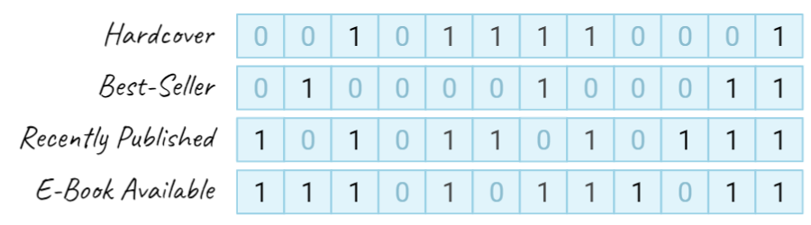
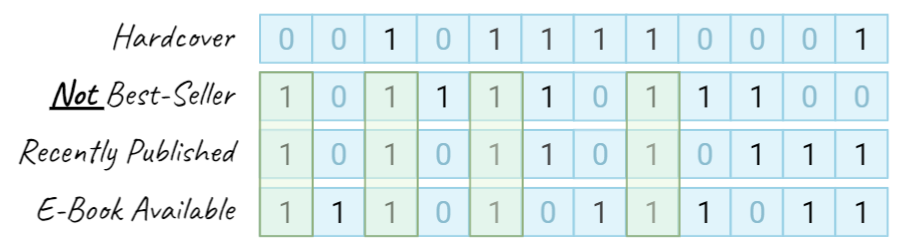

<p align="center">

<br>

<a href="https://pkg.go.dev/github.com/kelindar/bitmap"></a>
<a href="https://goreportcard.com/report/github.com/kelindar/bitmap"></a>
<a href="https://opensource.org/licenses/MIT"></a>
<a href="https://coveralls.io/github/kelindar/bitmap"></a>
</p>


## SIMD-Vectorized Bitmap (Bitset) in Go

This package contains a bitmap implementation, backed by a slice of `[]uint64` and designed for *dense* small or medium collections. This implementation focuses on high performance by avoiding heap allocations, unrolling loops and implementing SIMD vectorization in assembly.

## Features

 * Optimized for **zero heap allocation** for all of the important methods of the bitmap.
 * Optimized by **vectorized instructions (SIMD)** used for certain operations such as boolean algebra.
 * Support for **boolean algebra** that makes it perfect to implement [bitmap indexes](https://en.wikipedia.org/wiki/Bitmap_index).
 * Support for **bit counting** with operations such `Min()`, `Max()`, `Count()` and more.
 * Support for **fast iteration** over bits set to one by using an unrolled loop.
 * Support for **in-place filtering** based on a user-defined predicate.
 * Support for **binary encoding** and can be read/written and has a no-copy slice conversion.
 * Support for **reusability** by providing `Clone()` and `Clear()` operations.

## Documentation

The general idea of this package is to have a dead simple way of creating bitmaps (bitsets) that provide maximum performance on the modern hardware by using vectorized single-instruction multiple data ([SIMD](https://en.wikipedia.org/wiki/SIMD)) operations. As opposed to something as [roaring bitmaps](https://github.com/RoaringBitmap/roaring) which are excellent for sparse data, this implementation is designed to be used for small or medium dense bit sets. I've used this package to build a columnar in-memory store, so if you want to see how it can be used for indexing, have a look at [kelindar/column](https://github.com/kelindar/column). I'd like to specifically point out the indexing part and how bitmaps can be used as a good alternative to B*Trees and Hash Maps.

- [Boolean Algebra](#boolean-algebra)
- [Example Usage](#example-usage)
- [Benchmarks](#benchmarks)
- [Contributing](#contributing)


## Boolean Algebra

Perhaps one of the most useful features of this package is the vectorized implementation of boolean operations allowing us to perform boolean algebra on multiple bitmaps. For example, let's imagine that we have a dataset containing books, and four bitmaps defining one of the four properties of each book. In the figure below, you can imagine that our books can be on "columns" and each bit in a bitmap defines whether this attribute exists on a book or not.


<p align="center">

</p>

Now, if we want to find all books that were recently published and have an ebook available, we can use an `And()` method on our two bitmaps in order to combine them. In the example below we retrieve 3 hypothetical bitmaps and combine them to answer our query by calling and `And()` method to mutate the `books` bitmap twice.

```go
books  := bitmapFor("books")           // bitmap.Bitmap
recent := bitmapFor("books_recent")    // bitmap.Bitmap
ebooks := bitmapFor("books_has_ebook") // bitmap.Bitmap

// And operation actually mutates our "books" bitmap
books.And(recent)
books.And(ebooks)
```

<p align="center">

</p>

Now, what if we want to find recently published books which has e-book available but are *not* best-sellers? In that case, we could use binary `AndNot()` operation that hardware exposes. In the example below we combine

```go
books.And(recent)
books.And(ebooks)
books.AndNot(bestsellers) 
```

<p align="center">

</p>


## Example Usage

In its simplest form, you can use the bitmap as a bitset, set and remove bits. This is quite useful as an index (free/fill-list) for an array of data.

```go
import "github.com/kelindar/bitmap"
```

```go
bitmap := make(bitmap.Bitmap, 0, 8) // 8*64 = 512 elements pre-allocated
bitmap.Set(300)         // sets 300-th bit
bitmap.Set(400)         // sets 400-th bit
bitmap.Set(600)         // sets 600-th bit (auto-resized)
bitmap.Contains(300)    // returns true
bitmap.Contains(301)    // returns false
bitmap.Remove(400)      // clears 400-th bit

// Min, Max, Count
min, ok := bitmap.Min()  // returns 300
max, ok := bitmap.Max() // returns 600
count := bitmap.Count() // returns 2
```

The bits in the bitmap can also be iterated over using the `Range` method. It is a simple loop which iterates over and calls a callback. If the callback returns false, then the iteration is halted (similar to `sync.Map`).

```go
// Iterate over the bits in the bitmap
bitmap.Range(func(x uint32) bool {
    println(x)
    return true
})
```

Another way of iterating is using the `Filter` method. It iterates similarly to `Range` but the callback returns a boolean value, and if it returns `false` then the current bit will be cleared in the underlying bitmap. You could accomplish the same using `Range` and `Remove` but `Filter` is significantly faster.

```go
// Filter iterates over the bits and applies a callback
bitmap.Filter(func(x uint32) bool {
    return x % 2 == 0
})
```

Bitmaps are also extremely useful as they support boolean operations very efficiently. This library contains `And`, `AndNot`, `Or` and `Xor`.

```go
// And computes the intersection between two bitmaps and stores the result in the current bitmap
a := Bitmap{0b0011}
a.And(Bitmap{0b0101})

// AndNot computes the difference between two bitmaps and stores the result in the current bitmap
a := Bitmap{0b0011}
a.AndNot(Bitmap{0b0101})

// Or computes the union between two bitmaps and stores the result in the current bitmap
a := Bitmap{0b0011}
a.Or(Bitmap{0b0101})

// Xor computes the symmetric difference between two bitmaps and stores the result in the current bitmap
a := Bitmap{0b0011}
a.Xor(Bitmap{0b0101})
```

## Benchmarks
Benchmarks below were run on a large pre-allocated bitmap (slice of 100 pages, 6400 items).

```
cpu: Intel(R) Core(TM) i7-9700K CPU @ 3.60GHz
BenchmarkBitmap/set-8         	608127316     1.979 ns/op     0 B/op    0 allocs/op
BenchmarkBitmap/remove-8      	775627708     1.562 ns/op     0 B/op    0 allocs/op
BenchmarkBitmap/contains-8    	907577592     1.299 ns/op     0 B/op    0 allocs/op
BenchmarkBitmap/clear-8       	231583378     5.163 ns/op     0 B/op    0 allocs/op
BenchmarkBitmap/ones-8        	39476930      29.77 ns/op     0 B/op    0 allocs/op
BenchmarkBitmap/first-zero-8  	23612611      50.82 ns/op     0 B/op    0 allocs/op
BenchmarkBitmap/min-8         	415250632     2.916 ns/op     0 B/op    0 allocs/op
BenchmarkBitmap/max-8         	683142546     1.763 ns/op     0 B/op    0 allocs/op
BenchmarkBitmap/count-8       	33334074      34.88 ns/op     0 B/op    0 allocs/op
BenchmarkBitmap/clone-8       	100000000     11.46 ns/op     0 B/op    0 allocs/op
BenchmarkBitmap/simd-and-8    	74337927      15.47 ns/op     0 B/op    0 allocs/op
BenchmarkBitmap/simd-andnot-8 	80220294      14.92 ns/op     0 B/op    0 allocs/op
BenchmarkBitmap/simd-or-8     	81321524      14.81 ns/op     0 B/op    0 allocs/op
BenchmarkBitmap/simd-xor-8    	80181888      14.81 ns/op     0 B/op    0 allocs/op
BenchmarkBitmap/and-8         	29650201      41.68 ns/op     0 B/op    0 allocs/op
BenchmarkBitmap/andnot-8      	26496499      51.72 ns/op     0 B/op    0 allocs/op
BenchmarkBitmap/or-8          	20629934      50.83 ns/op     0 B/op    0 allocs/op
BenchmarkBitmap/xor-8         	23786632      51.46 ns/op     0 B/op    0 allocs/op
```

## Contributing

We are open to contributions, feel free to submit a pull request and we'll review it as quickly as we can. This library is maintained by [Roman Atachiants](https://www.linkedin.com/in/atachiants/)

## License

Tile is licensed under the [MIT License](LICENSE.md).
