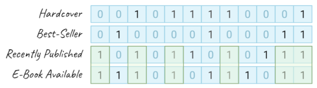

<p align="center">

<br>

<a href="https://pkg.go.dev/github.com/kelindar/bitmap"></a>
<a href="https://goreportcard.com/report/github.com/kelindar/bitmap"></a>
<a href="https://opensource.org/licenses/MIT"></a>
<a href="https://coveralls.io/github/kelindar/bitmap"></a>
</p>


## SIMD-Vectorized Bitmap (Bitset) in Go

This package contains a bitmap implementation, backed by a slice of `[]uint64` and designed for *dense* small or medium collections. This implementation focuses on high performance by avoiding heap allocations, unrolling loops and implementing SIMD vectorization in assembly.

## Features

 * Optimized for **zero heap allocation** for all of the important methods of the bitmap.
 * Optimized by **vectorized instructions (SIMD)** used for certain operations such as boolean algebra.
 * Support for **boolean algebra** that makes it perfect to implement [bitmap indexes](https://en.wikipedia.org/wiki/Bitmap_index).
 * Support for **bit counting** with operations such `Min()`, `Max()`, `Count()` and more.
 * Support for **fast iteration** over bits set to one by using an unrolled loop.
 * Support for **in-place filtering** based on a user-defined predicate.
 * Support for **binary encoding** and can be read/written and has a no-copy slice conversion.
 * Support for **reusability** by providing `Clone()` and `Clear()` operations.

## Documentation

The general idea of this package is to have a dead simple way of creating bitmaps (bitsets) that provide maximum performance on the modern hardware by using vectorized single-instruction multiple data ([SIMD](https://en.wikipedia.org/wiki/SIMD)) operations. As opposed to something as [roaring bitmaps](https://github.com/RoaringBitmap/roaring) which are excellent for sparse data, this implementation is designed to be used for small or medium dense bit sets. I've used this package to build a columnar in-memory store, so if you want to see how it can be used for indexing, have a look at [kelindar/column](https://github.com/kelindar/column). I'd like to specifically point out the indexing part and how bitmaps can be used as a good alternative to B*Trees and Hash Maps.

- [Boolean Algebra](#boolean-algebra)
- [Single Bit Operations](#single-bit-operations)
- [Bit Count and Search](#bit-count-and-search)
- [Iterate and Filter](#iterate-and-filter)
- [Example Usage](#example-usage)
- [Benchmarks](#benchmarks)
- [Contributing](#contributing)

First, here's what you need to do in order to import this package.

```go
import "github.com/kelindar/bitmap"
```

## Boolean Algebra

Perhaps one of the most useful features of this package is the vectorized implementation of boolean operations allowing us to perform boolean algebra on multiple bitmaps. For example, let's imagine that we have a dataset containing books, and four bitmaps defining one of the four properties of each book. In the figure below, you can imagine that our books can be on "columns" and each bit in a bitmap defines whether this attribute exists on a book or not.


<p align="center">

</p>

Now, if we want to find all books that were recently published and have an ebook available, we can use an `And()` method on our two bitmaps in order to combine them. In the example below we retrieve 3 hypothetical bitmaps and combine them to answer our query by calling and `And()` method to mutate the `books` bitmap twice.

```go
books  := bitmapFor("books")           // bitmap.Bitmap
recent := bitmapFor("books_recent")    // bitmap.Bitmap
ebooks := bitmapFor("books_has_ebook") // bitmap.Bitmap

// And operation actually mutates our "books" bitmap
books.And(recent)
books.And(ebooks)
```

<p align="center">

</p>

Now, what if we want to find recently published books which has e-book available but are *not* best-sellers? In that case, we could use binary `AndNot()` operation that hardware exposes. In the example below we combine

```go
books.And(recent)
books.And(ebooks)
books.AndNot(bestsellers) 
```

<p align="center">

</p>

## Single Bit Operations

When dealing with single elements, this package supports simple single-bit operations. They include `Set()` and `Remove()` to set a bit to one and to zero respectively, as well as `Contans()` to check for a presence (value set to one) of a certain bit. These methods are simple to use and setting a bit which is out of range would automatically resize the bitmap.

In the example below we're creating a bitmap, setting one bit to one, checking its presence and setting it back to zero after.

```go
var books bitmap.Bitmap

books.Set(3)                 // Set the 3rd bit to '1'
hasBook := books.Contains(3) // Returns 'true'
books.Remove(3)              // Set the 3rd bit to '0'
```

## Bit Count and Search

When using a bitmap for indexing or free-list purposes, you will often find yourself in need of counting how many bits are set in a bitmap. This operation actually has a specialized hardware instruction `POPCNT` and an efficient implementation is included in this library. The example below shows how you can simply count the number of bits in a bitmap by calling the `Count()` method.

```go
// Counts number of bits set to '1'
numBooks := books.Count()
```

On the other hand, you might want to find a specific bit either set to one or to zero, the methods `Min()`, `Max()` allow you to find first or last bit set to one while `MinZero()` and `MaxZero()` allow you to find first or last bit set to zero. The figure below demonstrates an example of that.

<p align="center">

</p>


## Iterate and Filter

The bits in the bitmap can also be iterated over using the `Range` method. It is a simple loop which iterates over and calls a callback. If the callback returns false, then the iteration is halted (similar to `sync.Map`).

```go
// Iterate over the bits in the bitmap
bitmap.Range(func(x uint32) bool {
    println(x)
    return true
})
```

Another way of iterating is using the `Filter` method. It iterates similarly to `Range` but the callback returns a boolean value, and if it returns `false` then the current bit will be cleared in the underlying bitmap. You could accomplish the same using `Range` and `Remove` but `Filter` is significantly faster.

```go
// Filter iterates over the bits and applies a callback
bitmap.Filter(func(x uint32) bool {
    return x % 2 == 0
})
```

## Example Usage

In its simplest form, you can use the bitmap as a bitset, set and remove bits. This is quite useful as an index (free/fill-list) for an array of data.

```go
import "github.com/kelindar/bitmap"
```

```go
var books := bitmap.Bitmap
books.Set(300)      // sets 300-th bit
books.Set(400)      // sets 400-th bit
books.Set(600)      // sets 600-th bit (auto-resized)
books.Contains(300) // returns true
books.Contains(301) // returns false
books.Remove(400)   // clears 400-th bit

// Min, Max, Count
min, ok := books.Min() // returns 300
max, ok := books.Max() // returns 600
count := books.Count() // returns 2

// Boolean algebra
var other bitmap.Bitmap
other.Set(300)
books.And(other)      // Intersection
count = books.Count() // Now returns 1
```

## Benchmarks
Benchmarks below were run on a pre-allocated bitmap of **100,000** elements containing with around 50% bits set to one.

```
cpu: Intel(R) Core(TM) i7-9700K CPU @ 3.60GHz
BenchmarkBitmap/set-8         552331321    4.319 ns/op    0 B/op    0 allocs/op
BenchmarkBitmap/remove-8     1000000000    1.621 ns/op    0 B/op    0 allocs/op
BenchmarkBitmap/contains-8   1000000000    1.309 ns/op    0 B/op    0 allocs/op
BenchmarkBitmap/clear-8        26083383    90.45 ns/op    0 B/op    0 allocs/op
BenchmarkBitmap/ones-8          6751939    347.9 ns/op    0 B/op    0 allocs/op
BenchmarkBitmap/min-8         757831477    3.137 ns/op    0 B/op    0 allocs/op
BenchmarkBitmap/max-8        1000000000    1.960 ns/op    0 B/op    0 allocs/op
BenchmarkBitmap/min-zero-8    776620110    3.081 ns/op    0 B/op    0 allocs/op
BenchmarkBitmap/max-zero-8   1000000000    1.536 ns/op    0 B/op    0 allocs/op
BenchmarkBitmap/count-8         6071037    382.5 ns/op    0 B/op    0 allocs/op
BenchmarkBitmap/count-to-8     82777459    28.85 ns/op    0 B/op    0 allocs/op
BenchmarkBitmap/clone-8        20654008    111.5 ns/op    0 B/op    0 allocs/op
BenchmarkBitmap/and-8          16813963    143.6 ns/op    0 B/op    0 allocs/op
BenchmarkBitmap/andnot-8       16961106    141.9 ns/op    0 B/op    0 allocs/op
BenchmarkBitmap/or-8           16999562    141.7 ns/op    0 B/op    0 allocs/op
BenchmarkBitmap/xor-8          16954036    144.7 ns/op    0 B/op    0 allocs/op
BenchmarkRange/range-8            18225   131908 ns/op    0 B/op    0 allocs/op
BenchmarkRange/filter-8           25636    93630 ns/op    0 B/op    0 allocs/op
```

## Contributing

We are open to contributions, feel free to submit a pull request and we'll review it as quickly as we can. This library is maintained by [Roman Atachiants](https://www.linkedin.com/in/atachiants/)

## License

Tile is licensed under the [MIT License](LICENSE).
